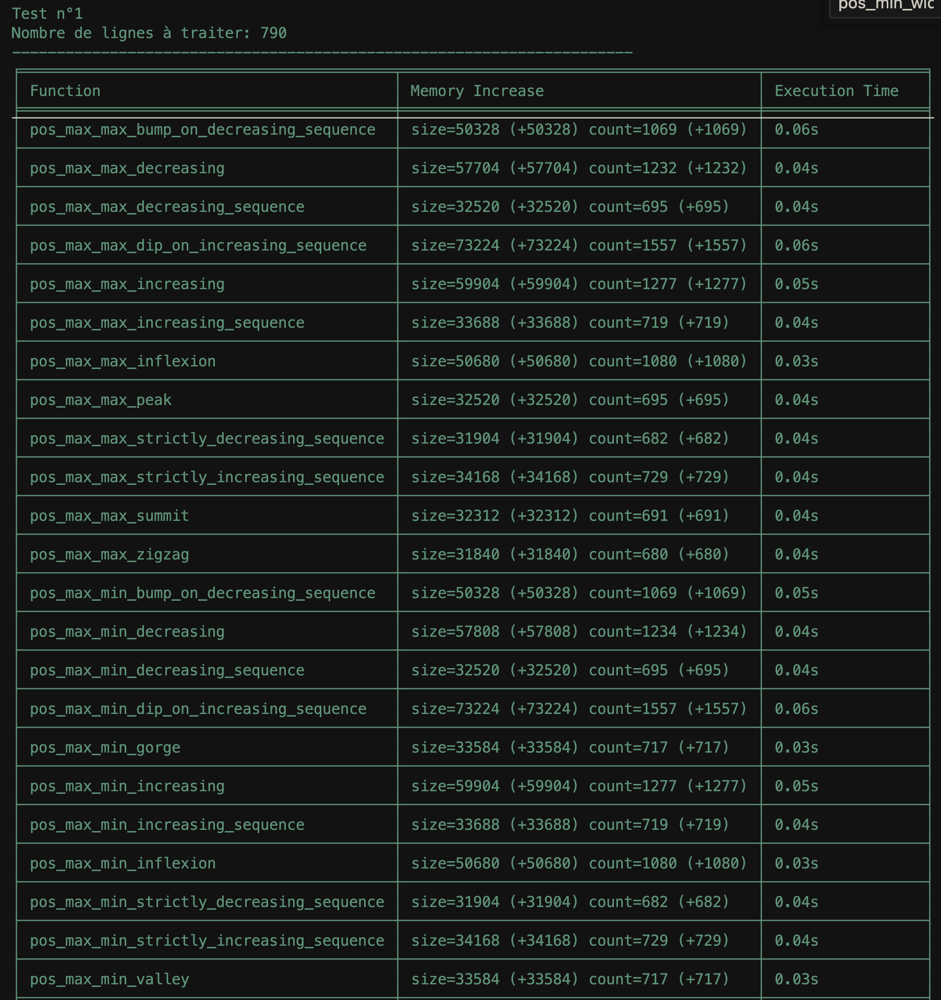

# IMT-A3-Time-Series-Constraints-Code-Generator

An attempt at implementing the algorithms described in the article : Using finite transducers for describing and synthesising structural time-series constraints

The goal is to generate a code that can be used to generate time series that satisfy the constraints.


## Installation

```bash
pip install -r requirements.txt
```

## Usage

#### Generate functions based on transducers:

```bash
python3 src/main.py --input_files transducers/*
```

Make sure that the transducers are in the correct format (see the examples in the transducers folder)
and in tranducers/ folder.

The generated functions will be in the 'gen/GeneratedFunctions.py' file.

## Tests

```bash
cd tests
python3 main.py
```

The test conatins 2 types of tests:
- Tests that check if the generated functions satisfy the constraints based on a list of Time Series
- Tests that check the performance of the generated functions based on big time series

For example, here is the output image (public/covied.png) of the performance test based on the Time Series: Covid new patients in intensive care:


